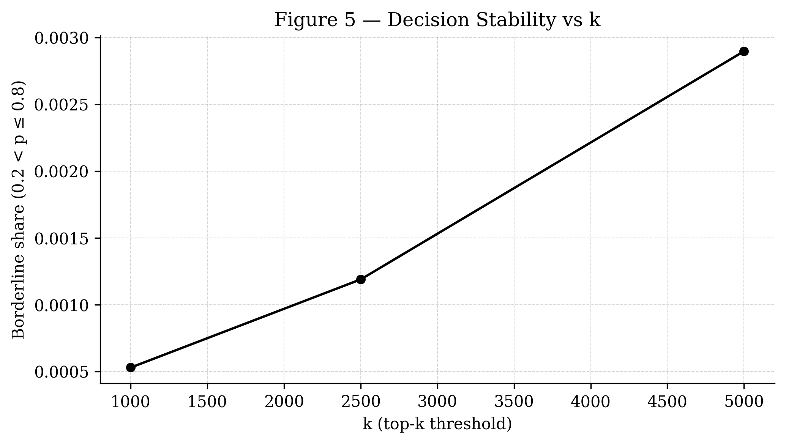
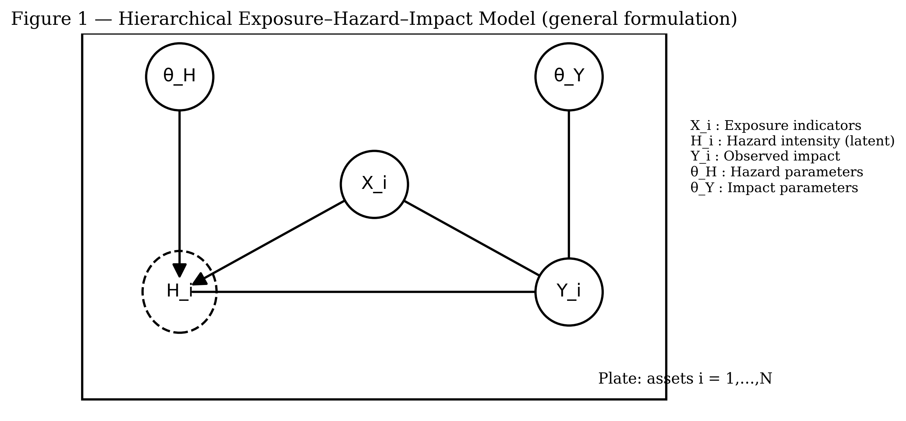
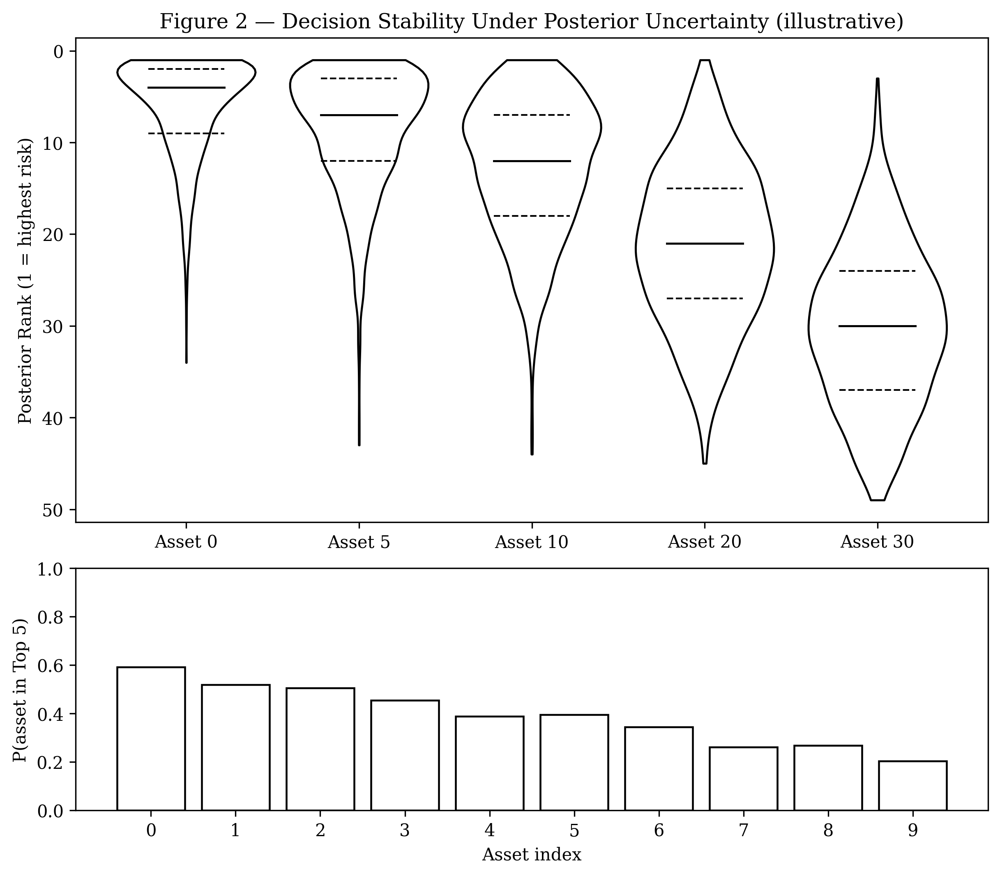
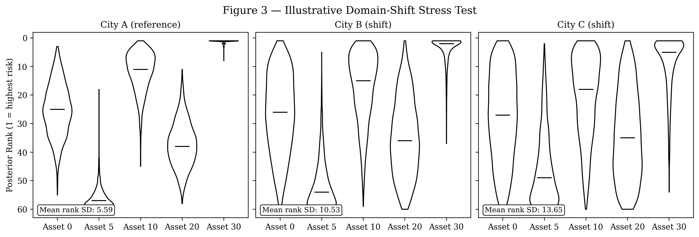

# 0. Abstract

This project investigates the stability of prioritisation decisions in urban pluvial flood risk assessments under epistemic uncertainty. While existing approaches quantify uncertainty within individual components of the exposure–hazard–impact chain, they rarely propagate it coherently to decision outputs.

This work proposes a unified hierarchical Bayesian framework linking exposure, hazard, and impact within a single generative model. Rather than focusing on expected loss estimates, the framework derives posterior distributions over prioritisation rankings, enabling the quantification of decision stability.

Decision-level quantities such as rank distributions and top-k membership probabilities are treated as primary inferential outputs. The framework is evaluated through cross-city transfer using a fixed generative specification, interpreted as a structural stress test.

This project reframes urban pluvial risk modelling from expected-loss estimation toward inference about the robustness of prioritisation decisions under uncertainty.

# 1. Introduction & Motivation

Urban flood risk assessments are routinely used to guide high-stakes infrastructure investment decisions. In practice, these decisions often take the form of prioritisation problems: given limited resources, which assets, neighbourhoods, or buildings should be protected first?

A municipality may need to select a subset of buildings—for example, the 500 most critical assets out of more than 200,000—for targeted flood mitigation measures. This selection is usually based on a ranking derived from estimated risk or expected loss.

Despite the apparent precision of such rankings, the underlying modelling process is uncertain. Risk estimates depend on exposure, hazard, and impact components, each of which involves incomplete data, modelling assumptions, and epistemic uncertainty.

In most practical workflows, this uncertainty is reduced to point estimates and then converted into a single deterministic ranking. As a result, uncertainty is effectively removed at the step where decisions are made, making it unclear whether prioritisation outcomes are robust or sensitive to modelling assumptions.

This project addresses this gap by treating prioritisation itself as an uncertain quantity. Rather than deriving a single ranking from expected values, the proposed framework derives a distribution over rankings from the joint posterior of a probabilistic model. Decision-level quantities such as rank distributions and top-k membership probabilities are then computed directly from posterior draws.

The central research question is:

> **How stable are prioritisation decisions in urban pluvial risk assessments once uncertainty is propagated coherently across the full exposure--hazard--impact chain?**

By reframing prioritisation as a posterior quantity, the project shifts urban flood risk assessment from expected-loss ranking toward inference about the robustness of decision-relevant outputs under uncertainty.

# 2. Problem Statement

Urban pluvial risk assessments typically follow a structured workflow in which exposure, hazard, and impact components are combined to produce asset-level risk estimates.

Uncertainty may be represented within individual components, for example through stochastic hazard inputs or probabilistic impact models. However, it is usually handled modularly rather than through a unified probabilistic framework.

The final step converts model outputs into prioritisation decisions by sorting point estimates such as expected loss or composite risk indices:

$$
\operatorname{rank}_i = \operatorname{argsort}\!\left(\mathbb{E}[\operatorname{risk}_i]\right)
$$

This transformation introduces a structural limitation. By collapsing each asset’s predictive distribution into a single summary statistic, it discards the uncertainty needed to assess whether the resulting prioritisation is robust.

Two consequences follow:

1. **Lack of coherent uncertainty propagation**  
   Uncertainty is not carried through the full exposure--hazard--impact chain into decision outputs.

2. **Deterministic representation of uncertain decisions**  
   Prioritisation rankings are presented as fixed orderings without quantifying their sensitivity to epistemic uncertainty.

As a result, decision-makers cannot assess whether prioritisation outcomes are robust or whether modest changes in assumptions could lead to different intervention choices. This absence of decision-level uncertainty quantification is the central problem addressed in this project.

The methodological question is therefore not only how to estimate risk under uncertainty, but how to preserve that uncertainty at the stage where intervention priorities are derived. The project addresses this by treating prioritisation itself as a probabilistic output rather than as deterministic post-processing.

# 3. Literature Review and Positioning

Research on uncertainty in urban flood risk assessment is extensive, but it is distributed across several partially disconnected strands. 
These strands address uncertainty at different stages of the modelling process, yet they are not designed to treat prioritisation decisions themselves as uncertain quantities.

The following review positions the present project by identifying both the contributions and the limits of four dominant approaches.

## 3.1 Bayesian damage modelling

A substantial body of work applies hierarchical Bayesian methods to model flood damage processes. 
Sairam et al. (2019) develop a hierarchical framework to capture spatiotemporal variability in flood damage under data scarcity. 
Mohor et al. (2021) estimate residential flood losses using multilevel models that account for heterogeneity across events and regions. 
Lv et al. (2021) construct flood loss ratio functions for data-scarce cities using hierarchical Bayesian techniques.

These approaches demonstrate that Bayesian methods provide a principled framework for representing parameter uncertainty, incorporating prior information, and pooling information across locations and events. 
They are particularly effective in settings where observational data are sparse, heterogeneous, or incomplete.

However, their primary inferential targets remain parameter estimation, predictive performance, and the transferability of damage functions. 
Uncertainty is quantified at the level of model parameters and predicted losses, but it is not propagated to the level of prioritisation decisions.

In practice, prioritisation is typically derived by ranking expected losses or summary statistics computed from posterior distributions. 
This step collapses the predictive distribution into a point estimate, thereby discarding the uncertainty required to assess whether the resulting prioritisation is stable.

As a result, Bayesian damage models improve the estimation of impact, but do not address the stability of the prioritisation decisions derived from those estimates.

## 3.2 End-to-end physical uncertainty propagation

A second strand focuses on propagating uncertainty through hydrological and hydraulic model cascades. 
McMillan and Brasington (2008) advocate for end-to-end flood risk assessment in which uncertainty is retained across coupled simulation stages, from rainfall generation to inundation and impact estimation.

This line of work is important in recognising that uncertainty is cumulative and that its propagation across model components is essential for realistic risk assessment. 
It emphasises process fidelity, physically grounded modelling, and the interaction between multiple sources of uncertainty.

However, the emphasis remains on representing uncertainty within the physical system rather than within the decision process. 
The outputs of such models are typically probabilistic hazard maps or expected loss estimates, which are subsequently translated into prioritisation decisions outside the probabilistic framework.

The final ranking or selection of assets is therefore often based on summary statistics derived from the model outputs. 
Consequently, while uncertainty is propagated through the physical cascade, it is not formally carried into the prioritisation decisions that guide interventions.

## 3.3 Bayesian network and susceptibility approaches

A third strand employs Bayesian networks and GIS-based probabilistic models to assess urban flood susceptibility. 
Wu et al. (2019, 2020) integrate hydrological, environmental, and socio-economic variables within Bayesian network structures to produce probabilistic risk maps.

These approaches are effective for combining heterogeneous data sources and representing conditional dependencies between variables in a flexible and interpretable way. 
They are particularly useful in data-limited contexts and for exploratory analysis of risk drivers.

Their outputs are typically expressed as probabilistic classifications or continuous susceptibility indices at the spatial level. 
While these representations capture uncertainty in a descriptive sense, they are not designed to support inference over prioritisation rankings.

In particular, these models do not specify a unified hierarchical generative structure linking exposure, hazard, and impact at the asset level. 
Nor do they derive decision-level quantities such as rank distributions or top-\(k\) membership probabilities.

As a result, they provide probabilistic descriptions of risk, but do not formalise prioritisation as an inferential object.

## 3.4 Robust decision-making under deep uncertainty

A fourth strand addresses uncertainty explicitly at the level of decision-making. 
Robust decision-making (RDM) and Info-Gap Decision Theory (IGDT) evaluate how policies perform across a wide range of uncertain futures and identify strategies that remain acceptable under adverse conditions (Hall & Harvey, 2009; Matrosov et al., 2013).

This literature is directly concerned with decision robustness and therefore closely related to the present project in its underlying motivation. 
It shifts attention from optimality under a single assumed model to performance across uncertain scenarios.

However, these approaches typically operate on ensembles of scenarios, performance metrics, or regret-based criteria rather than on posterior distributions derived from a probabilistic generative model. 
They are designed to evaluate policy alternatives rather than to analyse the statistical stability of prioritisation rankings produced by risk models.

In particular, they do not produce posterior distributions over asset-level prioritisation rankings within a unified exposure--hazard--impact framework. 
Their focus lies on the robustness of decisions across scenarios, not on the propagation of epistemic uncertainty through a probabilistic model into ranking-based decision outputs.

## 3.5 Position of the present project

The present project sits at the intersection of these strands but introduces a distinct inferential shift.

It does not propose a new hydraulic flood model, damage function, or robust planning framework. 
Instead, it integrates exposure, hazard, and impact within a single hierarchical probabilistic model and derives prioritisation decisions as posterior quantities.

Across the reviewed literature, uncertainty is either modelled within components, propagated through physical processes, or evaluated at the policy level. 
These approaches are not designed to embed the full exposure--hazard--impact chain within a single posterior or to represent prioritisation as a probabilistic output.

The contribution of the present project is therefore threefold:

- to formalise exposure--hazard--impact within a unified hierarchical posterior;
- to derive prioritisation rankings as distributions over posterior draws rather than as deterministic orderings;
- to quantify the stability of these rankings as an explicit inferential target.

While the underlying idea of propagating uncertainty is not new, its extension to prioritisation decisions is rarely implemented in practice because prioritisation is typically derived after uncertainty has been collapsed into point estimates.

By making decision stability measurable within a coherent probabilistic framework, the project connects probabilistic modelling and decision-making in a way that existing approaches do not explicitly address.

# 4. Research Gap and Contribution

Existing approaches reveal a consistent structural limitation: uncertainty is modelled within components of the risk chain, propagated through physical processes, or addressed at the level of policy evaluation, but rarely translated into uncertainty over prioritisation decisions.

This creates a gap between probabilistic modelling and decision-making. While exposure, hazard, and impact may be treated probabilistically, the final ranking and selection of assets is typically derived from point estimates and treated as deterministic.

The central contribution of this project is to redefine the inferential target of urban flood risk assessment. Rather than treating expected loss as the primary output, the proposed framework treats prioritisation decisions themselves as posterior quantities.

This leads to three contributions:

1. **Unified hierarchical posterior over the risk chain**  
   A single generative model linking exposure, hazard, and impact.

2. **Decision as a posterior quantity**  
   Rankings and top-k selections derived from posterior draws rather than expected values.

3. **Structural robustness via cross-city transfer**  
   A fixed-specification transfer design in which changes in ranking stability are interpreted as indicators of structural sensitivity.

The project is therefore methodological rather than domain-expansive. Its contribution is to provide a probabilistic basis for assessing the stability of prioritisation decisions under uncertainty.

# 5. Research Questions and Objectives

The central research question of this project is:

> **How stable are prioritisation decisions in urban pluvial risk assessments once uncertainty is propagated coherently across the full exposure--hazard--impact chain?**

This question follows directly from the gap identified in the preceding sections. 
Current workflows typically estimate risk under uncertainty, but then collapse that uncertainty into deterministic rankings. 
The present project instead asks whether the resulting intervention priorities remain stable once uncertainty is preserved through the full modelling pipeline.

To address this question, the project pursues four specific objectives:

1. **Formalise a unified probabilistic risk structure**  
   Develop a hierarchical generative framework linking exposure, hazard, and impact within a single coherent posterior distribution.

2. **Derive decision-level quantities from posterior inference**  
   Compute prioritisation outputs such as posterior rank distributions, top-\(k\) membership probabilities, and related stability measures directly from posterior draws rather than from point estimates.

3. **Evaluate decision stability in a large-scale urban case study**  
   Implement the framework for Rotterdam using the existing city-scale spatial pipeline in order to quantify how uncertainty affects prioritisation outcomes across more than 221,000 assets.

4. **Assess structural robustness under transfer**  
   Apply the same generative specification to additional cities and analyse how decision stability changes under domain shift, interpreting transfer as a structural stress test rather than as recalibration.

Taken together, these objectives translate the main research question into a staged methodological programme. 
The first objective establishes the probabilistic structure, the second defines the inferential outputs, the third tests the framework empirically, and the fourth examines its robustness beyond the reference case.

The overarching aim is not merely to estimate urban flood risk more precisely, but to determine how robust the prioritisation decisions derived from such models are under epistemic uncertainty.

# 6. Conceptual Framework

The proposed framework conceptualises urban pluvial risk assessment as a probabilistic system linking exposure, hazard, impact, and decision.

At its core, the framework follows a simple generative logic:

$$
\text{Exposure} \rightarrow \text{Hazard} \rightarrow \text{Impact} \rightarrow \text{Decision}
$$

## 6.1 System components

The framework operates at the level of individual assets \(i\), defined by:

- exposure indicators \(X_i\), describing asset characteristics and spatial context;
- hazard intensity \(H_i\), representing environmental forcing;
- impact \(Y_i\), representing realised or simulated damage outcomes.

These components are linked through a hierarchical structure in which hazard and impact are modelled probabilistically rather than treated as deterministic inputs.

Hazard is represented as a probabilistic input variable rather than as a fully resolved physical simulation. This reflects the scope of the project: the aim is not hydraulic completeness, but coherent uncertainty propagation through the exposure--hazard--impact chain into decision outputs.

## 6.2 Decision as part of the system

A key feature of the framework is that decisions are treated as endogenous to the modelling process rather than as an external post-processing step.

Instead of producing a single risk estimate for each asset and then ranking those estimates deterministically, the framework derives prioritisation decisions from posterior draws. Prioritisation is therefore understood as a distribution over possible orderings rather than a fixed list.

This allows decision-level quantities such as rank distributions, top-\(k\) membership probabilities, and ranking variability to be analysed directly.

## 6.3 Interpretation

Within this framework, uncertainty is not confined to model parameters or predictions, but extends to the prioritisation decisions themselves.

This makes it possible to distinguish between:

- **robust decisions**, where assets consistently appear in high-priority positions;
- **unstable decisions**, where ranking positions vary substantially under uncertainty.

The conceptual shift is therefore not the introduction of probabilistic modelling itself, but the extension of probabilistic reasoning to the level of decision outputs.

## 6.4 Scope

The framework is intentionally minimal in its initial form. It does not aim to provide a physically complete flood model or a full decision optimisation framework.

Its purpose is to isolate how epistemic uncertainty propagates through a simplified exposure--hazard--impact structure into prioritisation outcomes. This makes the stability of decisions analysable without conflating the question with the full complexity of hydraulic modelling.

# 7. Progress to Date

Substantial preparatory work has already been completed prior to and during the early phase of the project.

Between November 2025 and January 2026, a city-scale spatial data integration pipeline was developed for Rotterdam. This phase established the empirical foundation of the project by combining building footprints, hydrography layers, and derived exposure indicators into a consistent asset-level dataset.

The completed preparatory work includes:

- construction of a reproducible spatial preprocessing pipeline for Rotterdam;
- harmonisation of geospatial sources, identifiers, and coordinate systems;
- generation of building-level exposure indicators, including hydrographic proximity measures and local water density metrics at multiple spatial scales;
- assembly of a city-scale dataset covering approximately 221,000 buildings;
- development of a precipitation-based hazard proxy derived from ERA5-Land data;
- implementation of an initial Bayesian baseline model linking exposure, hazard, and impact;
- computation of preliminary posterior-based prioritisation metrics;
- preparation of conceptual figures and an initial methodological manuscript draft describing the probabilistic framework.

This progress shows that the project already rests on an operational empirical and computational foundation. The research therefore does not begin from a purely conceptual proposal, but from an existing pipeline that has already been tested on a full urban building stock.

Preliminary Phase 1 outputs already illustrate the empirical behaviour of the framework.

Figure 5 shows how the share of borderline assets changes as the prioritisation threshold \(k\) increases. Even for larger top-\(k\) sets, only a small fraction of assets fall within the intermediate probability region, suggesting that decision instability is concentrated near relatively narrow boundaries.

Figure 6 shows the distribution of top-\(k\) membership probabilities for borderline assets in the Top-1000 setting. This preliminary result illustrates the core inferential logic of the project: the posterior does not only produce expected risks, but also reveals where prioritisation membership is robust and where it remains uncertain.

The work completed so far should nevertheless be understood as foundational rather than conclusive. The current implementation relies on a simplified hazard representation and a synthetic outcome variable, and therefore serves primarily to validate the probabilistic inference and decision pipeline. The next phases extend this baseline toward richer uncertainty structures, sensitivity analysis, and cross-city structural transfer.

# 8. Generative Model

The framework is formalised as a hierarchical generative model linking exposure, hazard, and impact at the asset level.

## 8.1 Generative structure

For each asset \(i\), the model defines:

- exposure indicators \(X_i\),
- hazard intensity \(H_i\),
- impact outcome \(Y_i\),
- parameter vectors \(\theta_H\) and \(\theta_Y\).

The generative process is specified as:

$$
H_i \sim p(H \mid X_i, \theta_H)
$$

$$
Y_i \sim p(Y \mid H_i, X_i, \theta_Y)
$$

This structure encodes the assumption that hazard conditions depend on exposure context and that impact arises from the interaction between hazard and exposure.

## 8.2 Hazard representation

Hazard is treated as a probabilistic input variable informed by long-term precipitation patterns rather than as a hydrodynamic simulation. 

In the current implementation, \(H_i\) is approximated by an observed precipitation-derived proxy. Explicit latent hazard modelling is reserved for later stages of the project.

## 8.3 Joint posterior

Given observed data, Bayesian inference yields a joint posterior:

$$
p(\theta_H, \theta_Y, H \mid \text{data})
\propto
p(Y \mid H, X, \theta_Y)\, p(H \mid X, \theta_H)\, p(\theta_H)\, p(\theta_Y)
$$

This posterior defines a distribution over plausible system states consistent with the data and modelling assumptions.

## 8.4 Posterior predictive quantities

Posterior predictive outcomes are obtained by integrating over this joint distribution and form the basis for downstream analysis.

## 8.5 Link to decision inference

Decision-level quantities are derived from posterior draws rather than point estimates. For each posterior sample, asset-level risks are computed and transformed into a ranking, ensuring that uncertainty propagates coherently into prioritisation outputs.

# 9. Model Specification

The generative structure is instantiated as a hierarchical regression model linking exposure, hazard, and impact.

## 9.1 Baseline specification (Phase 1)

In Phase 1, the outcome \(Y_i\) is defined as a binary synthetic indicator and modelled using logistic regression:

$$
\text{logit}(p_i) = \alpha + \beta_E X_i + \beta_H H_i
$$

$$
Y_i \sim \text{Bernoulli}(p_i)
$$

where \(p_i = P(Y_i = 1)\).

Weakly informative priors are assigned to regularise inference:

$$
\alpha, \beta_E, \beta_H \sim \mathcal{N}(0, 2.5)
$$

This specification is intentionally simple and serves to validate the probabilistic pipeline and decision-level inference.

## 9.2 Predictors

Hazard enters as a continuous predictor and may interact with exposure in extended formulations. In Phase 1, both are standardised covariates.

The hazard component is treated as an observed proxy derived from precipitation data.

## 9.3 Likelihood extensions

The framework supports alternative likelihoods depending on data availability:

- Gaussian (continuous loss ratios)
- Log-normal or Gamma (positive loss values)
- Zero-inflated variants (excess non-damage cases)

## 9.4 Hierarchical structure and transfer

The model supports hierarchical extensions with partial pooling across cities while maintaining a fixed structural specification. This enables evaluation of model behaviour under domain shift without structural redefinition.

## 9.5 Inference

Posterior inference is performed via MCMC. Posterior draws are propagated directly to decision-level quantities to preserve uncertainty required for stability analysis.

# 10. Decision-Level Inference

The central contribution of the framework lies in deriving decision outputs from posterior distributions rather than point estimates. While conceptually straightforward, this step is rarely implemented in practice because prioritisation is typically derived after uncertainty has been collapsed into point estimates.

## 10.1 Posterior-induced rankings

For each posterior sample \(s\), asset-level risks are computed and converted into rankings:

$$
\text{rank}^{(s)} = \text{argsort}(\text{risk}^{(s)})
$$

Prioritisation is therefore represented as a distribution over rankings.

## 10.2 Decision-level quantities

This enables direct computation of:

- posterior rank distributions \(r_i^{(s)}\);
- top-\(k\) membership probabilities,
$$
P(i \in \text{top-}k) = \frac{1}{S} \sum_{s=1}^{S} \mathbf{1}(i \in \text{top-}k^{(s)})
$$
- ranking variability measures, such as the standard deviation of ranks.

These quantities constitute the primary inferential outputs.

## 10.3 Interpretation

- High top-\(k\) probability indicates robust prioritisation.
- Low probability indicates consistent exclusion.
- Intermediate values identify assets near decision boundaries.

Similarly, concentrated rank distributions indicate stability, while wide distributions indicate sensitivity to uncertainty.

## 10.4 Inferential shift

The framework shifts the question from:

> Which assets have the highest expected risk?

to:

> Which prioritisation decisions remain stable under uncertainty?

# 11. Cross-City Transfer as Structural Stress Test

The framework is evaluated across multiple cities using an identical generative specification.

## 11.1 Transfer logic

No structural modifications are introduced between contexts. Transfer is therefore treated as a test of whether the model structure remains informative across contexts rather than recalibration.

## 11.2 Evaluation

Analysis focuses on decision-level quantities:

- posterior rank distributions,
- top-\(k\) membership probabilities,
- ranking variability measures.

## 11.3 Interpretation

- Stable ranking behaviour suggests generalisable structure.
- Increased variability indicates sensitivity to domain shift.
- Shifts in top-\(k\) membership reflect changing decision boundaries.

Increases in rank dispersion are interpreted as structural stress rather than performance failure.

## 11.4 Role in the framework

Transfer serves as a diagnostic tool for assessing whether the assumed generative structure remains informative across contexts.

# 12. Empirical Implementation

## 12.1 Data and study area

The empirical analysis focuses on the municipality of Rotterdam, comprising approximately 221,000 buildings. This scale is important because the project is concerned with prioritisation under budget constraints in realistic urban settings, where decisions are made over very large asset populations rather than small illustrative samples.

The Rotterdam dataset builds on a pre-existing spatial data integration pipeline developed prior to the present modelling work. This pipeline combines multiple open data sources into a consistent asset-level representation.

The dataset integrates:

- building geometries derived from OpenStreetMap;
- hydrography layers describing relevant surface-water structures;
- ERA5-Land precipitation data;
- derived exposure indicators, including distance to water bodies and local hydrographic density at multiple spatial scales.

All data are harmonised and aggregated at the building level. The resulting dataset provides a large-scale asset-level representation suitable for probabilistic inference and decision analysis.

## 12.2 Hazard and outcome representation

In Phase 1, hazard is represented by a precipitation-derived proxy constructed from ERA5-Land indicators and standardised prior to modelling. This representation is intentionally simplified and is used to validate the end-to-end inference structure before introducing richer hazard formulations.

The outcome variable is a synthetic binary indicator. It is used solely to validate the probabilistic modelling and decision pipeline and is not interpreted as a calibrated estimate of observed flood damage. No empirical calibration claims are made at this stage.

## 12.3 Computational workflow

The modelling workflow follows the structure defined in previous sections:

1. construction of exposure and hazard covariates at the asset level;
2. specification of the probabilistic exposure--hazard--impact model;
3. Bayesian inference via MCMC;
4. posterior predictive evaluation of asset-level impact probabilities;
5. computation of posterior-derived prioritisation metrics.

Inference is performed using Hamiltonian Monte Carlo as implemented in PyMC. Posterior outputs are then propagated to decision-level quantities such as rank distributions, top-\(k\) membership probabilities, and related stability measures.

A first citywide output of the Phase-1 model is the distribution of posterior mean impact probabilities across all buildings. Figure 4 shows that these probabilities are concentrated near low values, with only a relatively small fraction of assets occupying the upper tail of the distribution.

## 12.4 Reproducibility

All data processing, modelling, and analysis steps are implemented in reproducible Python pipelines and maintained in open repositories. This includes spatial preprocessing scripts, model specification and inference code, posterior analysis workflows, and figure-generation routines.

This reproducible computational setup is central to the project’s methodological contribution: the framework is intended not only as a conceptual proposal, but as an operational research pipeline that can be extended to additional cities and more complex hazard representations.

# 13. Expected Contributions

The project is primarily methodological, with empirical components serving to demonstrate the framework in practice. Taken together, the proposed contributions establish decision stability as a measurable property of probabilistic risk models.

## 13.1 Methodological contributions

1. **Unified probabilistic exposure--hazard--impact structure**  
   Formalisation of the full risk chain within a single hierarchical posterior.

2. **Decision stability as an inferential target**  
   Prioritisation rankings and top-\(k\) membership are treated as posterior quantities rather than deterministic outputs.

3. **Posterior-based ranking analysis**  
   Explicit derivation of rank distributions and decision-level stability metrics from posterior draws.

4. **Cross-city transfer as structural stress test**  
   Evaluation of whether the same generative structure remains informative under domain shift.

## 13.2 Empirical contributions

1. **Quantification of prioritisation instability**  
   Measurement of how epistemic uncertainty affects ranking behaviour in a large urban asset population.

2. **Evidence on decision boundaries**  
   Identification of narrow subsets of assets for which prioritisation membership is sensitive to uncertainty.

3. **Evidence under domain shift**  
   Analysis of how ranking behaviour changes across cities when the generative specification is held fixed.

The project therefore reframes flood risk modelling from expected-loss estimation toward decision stability analysis.

# 14. Limitations and Scope

The current implementation adopts a simplified specification to isolate the behaviour of the inference and decision pipeline.

## 14.1 Hazard

Hazard is represented by a precipitation proxy rather than a hydrodynamic model. Detailed flood processes are not captured.

## 14.2 Outcome

The outcome variable is synthetic and not calibrated to observed damage.

## 14.3 Exposure

Exposure is approximated using hydrography-based indicators and does not capture the full range of vulnerability factors (e.g. building typology, elevation, drainage conditions).

## 14.4 Scope

Results should be interpreted as evidence about the probabilistic framework rather than operational risk estimates. Future work will extend hazard, outcome, and exposure representations while preserving the generative structure.

# 15. Work Plan

The project is structured in four phases. Preparatory work conducted prior to the formal project start (November 2025 – January 2026) established the spatial data pipeline and initial exposure indicators that enable the Phase 1 implementation.

## Phase 1 — Baseline probabilistic pipeline (completed)  
February–March 2026

**Tasks**
- Finalisation of the Rotterdam exposure--hazard--impact dataset building on the pre-existing spatial data pipeline
- Implementation of the Bayesian baseline model
- Computation of posterior decision stability metrics
- Preparation of a methodological baseline manuscript (working paper / preprint)

**Expected output**
- city-scale Rotterdam dataset ready for probabilistic modelling;
- baseline Bayesian workflow implemented;
- initial decision-stability results and figures;
- methodological draft documenting the framework.

**Risk**
- Limited empirical realism due to simplified hazard and synthetic outcome representation.

**Mitigation**
- Treat Phase 1 explicitly as methodological validation of the inference and decision pipeline rather than as a final operational model.

## Phase 2 — Posterior decision stability analysis  
April–June 2026

**Tasks**
- Extension of posterior analysis
- Sensitivity analysis of priors and model specifications
- Evaluation of alternative hazard proxy definitions
- Robustness analysis of ranking-based decision metrics

**Expected output**
- refined posterior decision-stability analysis;
- sensitivity results for model assumptions and ranking metrics;
- clearer characterisation of decision boundaries under uncertainty.

**Risk**
- Posterior ranking behaviour may prove highly sensitive to modelling choices, making interpretation unstable.

**Mitigation**
- compare multiple specifications explicitly and treat sensitivity itself as a substantive result rather than a failure.

## Phase 3 — Cross-city structural transfer  
July–October 2026

**Tasks**
- Application of the fixed-specification model to additional cities
- Evaluation of posterior ranking behaviour under domain shift
- Quantification of instability changes across contexts

**Expected output**
- comparative transfer analysis across urban contexts;
- empirical evidence on whether the same generative structure remains informative under domain shift;
- assessment of structural stress through changes in decision-level quantities.

**Risk**
- transfer may reveal strong context dependence and degraded ranking stability.

**Mitigation**
- interpret instability inflation as evidence about structural limits of the model, not simply as predictive failure.

## Phase 4 — Model extension and synthesis  
November 2026 – February 2027

**Tasks**
- Introduction of an explicit latent hazard layer
- Comparison of proxy-based and latent hazard formulations
- Integration of cross-city results
- Preparation of journal manuscript

**Expected output**
- extended model specification with richer hazard treatment;
- synthesis of within-city and cross-city findings;
- journal manuscript presenting the research programme and results.

**Risk**
- increasing model complexity may reduce interpretability or make inference computationally more demanding.

**Mitigation**
- retain the simplest defensible specification as baseline and introduce additional complexity only where it improves inferential value.

# 16. References

Gelman, A., Carlin, J. B., Stern, H. S., Dunson, D. B., Vehtari, A., & Rubin, D. B. (2013). *Bayesian data analysis* (3rd ed.). CRC Press.

Hall, J. W., & Harvey, H. (2009). Decision making under severe uncertainties for flood risk management: A case study of Info-Gap robustness analysis. In *Proceedings of the 8th International Conference on Hydroinformatics*, Concepción, Chile.

Lv, H., Wu, Z., Guan, X., & Meng, Y. (2021). The construction of flood loss ratio function in cities lacking loss data based on dynamic proportional substitution and hierarchical Bayesian model. *Journal of Hydrology, 592*, 125797. https://doi.org/10.1016/j.jhydrol.2020.125797

Matrosov, E. S., Woods, A. M., & Harou, J. J. (2013). Robust decision making and Info-Gap decision theory for water resource system planning. *Journal of Hydrology, 494*, 43–58. https://doi.org/10.1016/j.jhydrol.2013.03.006

McElreath, R. (2020). *Statistical rethinking: A Bayesian course with examples in R and Stan* (2nd ed.). Chapman and Hall/CRC.

McMillan, H. K., & Brasington, J. (2008). End-to-end flood risk assessment: A coupled model cascade with uncertainty estimation. *Water Resources Research, 44*(3). https://doi.org/10.1029/2007WR005995

Mohor, G. S., Thieken, A. H., & Korup, O. (2021). Residential flood loss estimated from Bayesian multilevel models. *Natural Hazards and Earth System Sciences, 21*, 1599–1614. https://doi.org/10.5194/nhess-21-1599-2021

Raiffa, H., & Schlaifer, R. (1961). *Applied statistical decision theory*. Harvard University Press.

Sairam, N., Schröter, K., Rözer, V., Merz, B., & Kreibich, H. (2019). A Bayesian hierarchical model for flood damage estimation in data-scarce regions. *Water Resources Research, 55*(11), 9129–9151. https://doi.org/10.1029/2019WR025068

Vehtari, A., Gelman, A., & Gabry, J. (2017). Practical Bayesian model evaluation using leave-one-out cross-validation and WAIC. *Statistics and Computing, 27*, 1413–1432. https://doi.org/10.1007/s11222-016-9696-4

Wu, Z., Shen, Y., Wang, H., & Wu, M. (2019). Assessing urban flood disaster risk using Bayesian network model and GIS applications. *International Journal of River Basin Management, 17*(4), 2163–2184. https://doi.org/10.1080/19475705.2019.1685010

Wu, Z., Shen, Y., Wang, H., & Wu, M. (2020). Urban flood disaster risk evaluation based on ontology and Bayesian network. *Journal of Hydrology, 583*, 124596. https://doi.org/10.1016/j.jhydrol.2020.124596