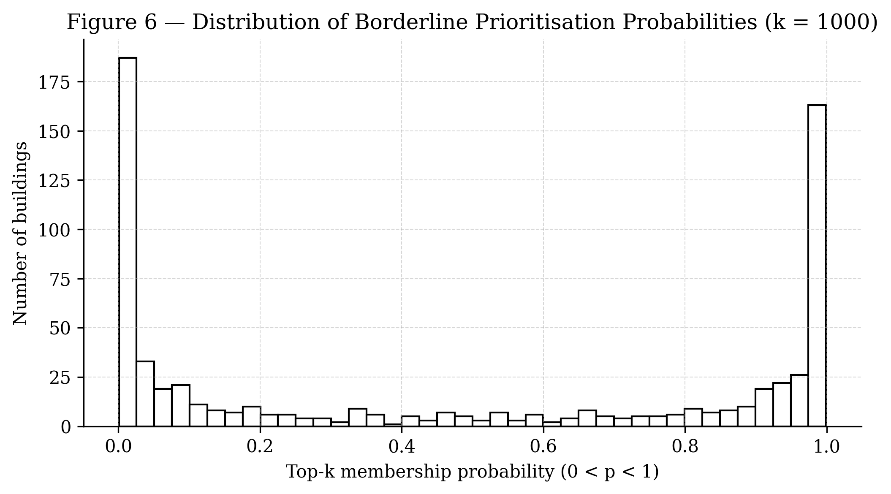
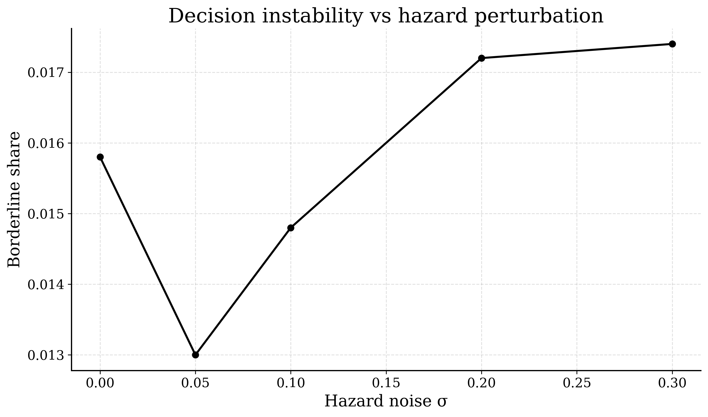

## Abstract

Urban risk assessments often produce ranked lists of assets or locations to guide infrastructure investment and resilience planning. These rankings are typically derived from deterministic risk scores or expected impact estimates. While uncertainty may be quantified within individual model components, it is rarely propagated through the full exposure–hazard–impact chain to the prioritisation decisions themselves.

This paper introduces a reproducible Bayesian baseline for propagating uncertainty from exposure and hazard proxies to decision-relevant prioritisation metrics in urban pluvial risk assessment. This allows prioritisation decisions themselves to be analysed as random variables derived from the posterior, rather than fixed rankings derived from uncertain inputs.

Using Rotterdam as a case study (~221,324 buildings), we construct an exposure–hazard–outcome pipeline and perform Bayesian inference to estimate posterior distributions of asset-level impact probabilities. Prioritisation decisions are then derived from posterior draws rather than point estimates.

We quantify decision stability using posterior-derived metrics including top-k membership probability and borderline share. Results indicate that most assets exhibit stable prioritisation outcomes under the current modelling assumptions, while a small fraction occupy a narrow decision boundary where ranking uncertainty is concentrated. This structure is further shown to be robust under controlled perturbations of the hazard proxy, suggesting that the observed decision boundary is not driven by deterministic hazard specification.

This work provides a minimal probabilistic baseline for analysing decision stability in urban risk prioritisation and establishes a foundation for later extensions incorporating hazard uncertainty and cross-city transfer.

---

# 1. Introduction

Urban resilience planning frequently relies on ranked lists of assets requiring intervention, such as buildings, infrastructure segments, or neighbourhoods. These rankings typically emerge from deterministic risk scores or expected damage estimates. In practice, these rankings directly determine which assets receive intervention under limited budgets, making their stability a critical but often unexamined property.

However, risk estimation involves substantial uncertainty arising from:

- hazard variability
- exposure measurement error
- model specification
- limited observational data

Although uncertainty may be analysed within individual modelling components, it is rarely propagated through the full modelling chain to the final prioritisation decisions.

As a result, the stability of ranked intervention lists remains largely unexplored.

This paper proposes treating **prioritisation stability itself as the primary inferential object**. While uncertainty propagation has been widely studied within individual components of flood risk models, particularly in Bayesian flood damage modelling and hydrological ensemble simulations (Sairam et al., 2019; Mohor et al., 2021; McMillan & Brasington, 2008), the stability of the resulting prioritisation decisions has received comparatively little attention.

Instead of asking only:

> Which assets appear most at risk?

we ask:

> How stable are prioritisation decisions when uncertainty is propagated through the modelling pipeline?

To explore this question, we construct a reproducible Bayesian baseline for urban pluvial risk assessment and derive prioritisation metrics directly from posterior distributions.

The contribution of this paper is therefore methodological: rather than improving hazard or damage estimation alone, the framework evaluates how uncertainty propagates into the stability of prioritisation decisions themselves.

### Contributions

This paper makes three main contributions:

- A reproducible **exposure–hazard–outcome modelling pipeline**
- A **Bayesian inference baseline** for asset-level impact probability
- A set of **posterior-derived prioritisation metrics** for quantifying decision stability

These contributions are demonstrated through a citywide decision stability analysis for Rotterdam (~221k assets). The framework is further designed for later transfer to Hamburg and Donostia–San Sebastián.

---

# 2. Conceptual Framework

Urban flood risk assessments typically follow a conceptual structure linking:

Exposure → Hazard → Impact (Outcome)

where exposure describes asset characteristics, hazard represents environmental forcing, and impact represents realised damage or disruption.

Probabilistic approaches to flood risk modelling have previously been applied to individual components of this chain, including Bayesian damage estimation (Sairam et al., 2019; Mohor et al., 2021) and probabilistic flood susceptibility models using Bayesian networks (Wu et al., 2019, 2020).

In probabilistic terms this can be expressed as a generative model:

Data → Exposure → Hazard → Outcome  
→ Posterior inference  
→ Decision metrics

Posterior inference produces distributions over model parameters and asset-level risk probabilities. Rather than collapsing these distributions to point estimates, we derive decision quantities directly from the posterior.

This allows prioritisation decisions to be analysed probabilistically.

### Graphical model

Figure 1 illustrates the hierarchical exposure–hazard–impact structure underlying the model.

### Decision stability concept

Figure 2 illustrates how posterior uncertainty propagates to asset ranking distributions and top-k membership probabilities.

These quantities form the basis for the decision stability metrics analysed in the Rotterdam case study.

### Domain-shift stress test (conceptual)

Figure 3 illustrates the conceptual domain-shift experiment proposed for later phases of the research. The model specification remains fixed while the framework is applied across different cities. If the generative assumptions are stable, posterior ranking behaviour should remain similar across cities. Under domain shift, ranking variability is expected to increase, producing wider posterior rank distributions and larger decision instability.

This experiment forms the basis of the cross-city transfer analysis planned for future phases of the research.

---

# 3. Data and Study Area

The modelling pipeline is applied to the municipality of **Rotterdam, Netherlands**, containing approximately **221,324 buildings**.

The dataset integrates several open data sources:

- **OpenStreetMap building footprints**
- **Dutch hydrography datasets**
- **ERA5-Land precipitation data**

### Exposure proxy

A deterministic exposure proxy $\hat{E}_i$ is constructed using spatial indicators of building proximity to water bodies and local hydrographic density.

In Phase 1, exposure is represented by a deterministic index constructed from hydrography proximity features, including distance to the nearest water body and water length density within multiple buffer radii, and standardised prior to modelling.

### Hazard proxy

A pluvial hazard proxy $H_i$ is derived from precipitation forcing indicators. The hazard representation is intentionally simplified in Phase 1 to focus on validating the inference pipeline.

Hazard is represented by a deterministic pluvial forcing proxy derived from ERA5-Land precipitation indicators and standardised prior to modelling.

### Outcome variable

The outcome variable represents a **synthetic damage indicator**, used solely to validate the probabilistic inference structure. No claims of empirical calibration are made in this phase. The purpose of this synthetic outcome is not to estimate real-world flood risk, but to evaluate the behaviour of the probabilistic inference-to-decision pipeline under controlled conditions.

---

# 4. Bayesian Model

The model defines a simple generative structure linking exposure, hazard proxy, and binary impact outcome. We assume that, conditional on the proxy variables $E_i$ and $H_i$, asset-level outcomes $Y_i$ are generated independently across assets according to a Bernoulli process with probability $p_i$. The variables $E_i$ and $H_i$ are treated as observed proxies for latent exposure and hazard processes, and no additional dependence structure is modelled at this stage.

Asset-level impact probability is modelled using a logistic regression structure:

$$
p_i =
\text{logit}^{-1}
\left(
\alpha + \beta_E E_i + \beta_H H_i
\right)
$$

$$
Y_i \sim \text{Bernoulli}(p_i)
$$

where:

- $E_i$ denotes the exposure proxy
- $H_i$ denotes the hazard proxy
- $Y_i \in \{0,1\}$ denotes the impact indicator

### Priors

Weakly informative priors are assigned to model parameters:

$$
\alpha, \beta_E, \beta_H \sim \mathcal{N}(0, 2.5)
$$

### Inference

Posterior inference is performed using **PyMC** with Hamiltonian Monte Carlo sampling.

Diagnostics include:

- $\hat{R}$ convergence diagnostics
- effective sample size (ESS)
- posterior predictive checks

All model parameters achieved $\hat{R} < 1.01$, with effective sample sizes exceeding 500 for all reported variables, indicating stable and well-mixed posterior sampling.

Posterior draws produce asset-level probability distributions of impact.

We sample using NUTS in PyMC with 2 chains, 500 tuning steps and 500 posterior draws per chain (`target_accept = 0.9`). Citywide decision metrics are computed by applying posterior draws to the full building set ($N = 221{,}324$).

### Model scope

The logistic specification is intentionally minimal, serving as a baseline to isolate the behaviour of posterior-derived decision metrics rather than to optimise predictive performance. The objective in Phase 1 is to validate the probabilistic inference and decision pipeline, not to provide a fully calibrated predictive model.

### Posterior distribution

The posterior distribution over model parameters is

$$
p(\theta \mid \text{data})
\propto
p(\text{data} \mid \theta)\,p(\theta)
$$

where

$$
\theta = (\alpha, \beta_E, \beta_H)
$$

---

# 5. Posterior-Derived Decision Metrics

Rather than relying on point estimates, prioritisation decisions are derived from posterior draws.

### Posterior mean risk

For each asset $i$:

$$
p_{\text{mean}, i}
=
\mathbb{E}_{p(\theta \mid \text{data})}
\left[
P(Y_i = 1 \mid \theta)
\right]
$$

The distribution of posterior mean probabilities across the city is analysed in the Results section.

### Top-k membership probability

For a prioritisation threshold $k$, the probability that asset $i$ belongs to the top-k highest risk assets is:

$$
P(i \in \text{Top}_k \mid \text{posterior})
$$

### Decision stability metrics

Several metrics quantify ranking stability:

- **Top-k overlap ratio**
- **Posterior entropy of membership probability**
- **Borderline share**, defined as assets with

$$
0.2 < P(i \in \text{Top}_k) < 0.8
$$

### Computational implementation

All analyses are implemented in Python using PyMC for Bayesian inference and ArviZ for posterior diagnostics. The analysis pipeline, data preparation scripts, and manuscript sources are available in open repositories to support reproducibility.

---

# 6. Results

The analysis covers **221,324 buildings** across the municipality of Rotterdam.

## 6.1 Posterior risk distribution

Figure 4 shows the empirical cumulative distribution of posterior mean impact probabilities across all buildings.

Posterior mean probabilities are strongly concentrated near low values, with a **mean of 0.077**, a **median of 0.055**, and a **90th percentile of 0.166**. Only a small fraction of assets occupy the upper tail of the distribution, with the **99th percentile reaching 0.421** and a maximum value of **0.768**.

This skewed distribution reflects the sparse structure of the synthetic outcome generation process and provides a useful setting for analysing how posterior uncertainty affects prioritisation decisions.

## 6.2 Decision stability across prioritisation thresholds

Decision stability is evaluated by analysing how frequently assets fall within the top-k highest risk positions across posterior draws.

The borderline share represents assets whose top-k membership probability lies between 0.2 and 0.8. These assets occupy the decision boundary where prioritisation outcomes are sensitive to posterior uncertainty.

Across prioritisation thresholds, the borderline share remains extremely small relative to the total asset population. For **k = 1000**, the borderline share is **0.053%**, increasing slightly to **0.29%** for **k = 5000**. Even at larger prioritisation sets, only a very small subset of assets exhibits unstable prioritisation behaviour.

This indicates that posterior uncertainty affects only a narrow decision boundary rather than the overall prioritisation structure.

## 6.3 Borderline decision region

To better understand where instability occurs, we examine the distribution of top-k membership probabilities across assets.

For the **Top-1000 prioritisation threshold**, the mean membership probability is **0.0045**, consistent with the expected proportion of selected assets in the citywide dataset. Most assets have membership probabilities close to either **0** or **1**, indicating stable prioritisation outcomes.

Only a very small fraction of assets fall within the intermediate region $0.2 < P(i \in \text{Top}_k) < 0.8$, with a borderline share of approximately **0.00052**. These assets form a narrow decision boundary where ranking positions fluctuate across posterior draws and where additional information or improved modelling could most influence prioritisation decisions.

Overall, posterior uncertainty is not diffuse across the system but sharply concentrated at the prioritisation boundary. Most assets exhibit stable rankings, while only a small subset drives decision instability. This suggests that probabilistic prioritisation is not only descriptive, but operationally useful: it identifies exactly where additional data or model refinement would have the greatest impact on decision quality.

This concentration of instability at the decision boundary implies that most prioritisation decisions are robust under current assumptions, and that uncertainty reduction efforts can be targeted efficiently rather than applied uniformly across all assets.

## 6.4 Robustness to Hazard Perturbation

The results above are derived using a deterministic hazard proxy. To assess whether the observed concentration of decision instability depends on this assumption, we introduce controlled perturbations to the hazard representation. This experiment can be interpreted as a test of whether the observed concentration of decision instability is an artefact of deterministic hazard specification or a structural property of the inference–decision pipeline.

The following values are computed on the inference subsample (N = 5000) and are therefore not directly comparable to the citywide percentages reported in Sections 6.2–6.3.

The standardised hazard variable is perturbed as:

$$
H_i^{\text{perturbed}} = H_i + \epsilon_i, \quad \epsilon_i \sim \mathcal{N}(0, \sigma)
$$

We evaluate multiple perturbation levels:

- $\sigma$ = 0.00 (baseline)
- $\sigma$ = 0.05
- $\sigma$ = 0.10
- $\sigma$ = 0.20
- $\sigma$ = 0.30

For each scenario, the full inference pipeline is re-run and decision metrics are recomputed.

### Results

| $\sigma$     | Borderline Share |
|------|------------------|
| 0.00 | 0.0158 |
| 0.05 | 0.0130 |
| 0.10 | 0.0148 |
| 0.20 | 0.0172 |
| 0.30 | 0.0174 |

The borderline share remains within a narrow range (~1.3–1.7%) across all perturbation levels.

### Interpretation

The concentration of decision instability within a narrow boundary is robust to moderate perturbations ($\sigma$ up to 0.30 in standardised hazard space) of the hazard proxy.

This indicates that the observed prioritisation structure is not an artefact of a fixed hazard input, but rather a structural property of the model and data. Most assets retain stable prioritisation behaviour, while a small subset near the decision threshold continues to drive variability.

These results support the interpretation that posterior-derived prioritisation stability is inherently localised, and not highly sensitive to moderate uncertainty in hazard representation.

---

# 7. Discussion

This study demonstrates how prioritisation decisions in urban risk assessment can be analysed as probabilistic objects rather than deterministic rankings. By deriving decision metrics directly from posterior distributions, the framework makes it possible to evaluate not only which assets appear most at risk, but also how stable those prioritisation decisions remain under model uncertainty.

The Rotterdam case study indicates that posterior uncertainty primarily affects a narrow subset of assets located near the prioritisation boundary. Most assets exhibit membership probabilities close to either zero or one, suggesting that the majority of ranking outcomes remain stable across posterior draws. Instability is concentrated in a relatively small decision boundary where ranking positions fluctuate. Identifying this boundary is useful for decision-makers, as it highlights locations where additional data collection or improved modelling could most influence intervention priorities.

More broadly, this work illustrates how probabilistic inference can be linked directly to decision-relevant quantities. Instead of summarising uncertainty solely through parameter estimates or predictive intervals, the approach evaluates uncertainty in the prioritisation outcome itself. This perspective enables decision-makers to distinguish between robust prioritisation outcomes and those that are sensitive to modelling assumptions. Previous work has often used probabilistic models to improve parameter estimation or predictive performance within specific components of flood risk assessment, such as damage functions or susceptibility mapping (Sairam et al., 2019; Wu et al., 2019). In contrast, the present framework evaluates uncertainty in the prioritisation outcome itself by analysing posterior ranking distributions and top-k membership probabilities.

These findings are reinforced by the hazard perturbation experiment, which shows that the concentration of decision instability remains stable under moderate noise in the hazard proxy. This suggests that the observed decision boundary is not merely a consequence of deterministic inputs, but reflects a structural property of the inference and ranking mechanism.

Phase 1 intentionally employs simplified hazard and outcome representations in order to validate the statistical structure of the inference and decision pipeline. Future work will extend the framework in two directions. First, more realistic hazard representations will be introduced to account for variability in pluvial forcing and spatial flood processes. Second, the framework will be applied across multiple cities to evaluate how prioritisation stability behaves under domain shift and structural uncertainty.

Together, these extensions will allow the proposed framework to assess not only the stability of prioritisation decisions within a single urban system, but also their robustness across different environmental and modelling contexts.

---

# 8. Limitations

Several limitations should be noted:

- The hazard representation is simplified and does not model physical flood dynamics.
- The outcome variable is synthetic and not calibrated to observed damage.
- Exposure proxies are limited to hydrographic proximity indicators.

These simplifications are intentional in the present baseline study to isolate the statistical behaviour of the inference and decision pipeline.

---

# 9. Conclusion

This paper introduces a probabilistic framework for analysing prioritisation stability in urban flood risk assessment.

By deriving decision metrics directly from posterior distributions, the framework enables explicit evaluation of ranking robustness.

The Rotterdam case study demonstrates that prioritisation instability is concentrated in a small subset of assets and remains robust under moderate perturbations of the hazard proxy, highlighting where additional data or modelling effort may most improve decision reliability.

Future work will extend this framework to hazard uncertainty and cross-city transfer experiments.

---

# References

Hall, J. W., & Harvey, H. (2009). Decision making under severe uncertainties for flood risk management: A case study of Info-Gap robustness analysis. *Journal of Flood Risk Management*. https://doi.org/10.1111/j.1753-318X.2009.01034.x

Lv, H., Wu, Z., Guan, X., & Meng, Y. (2021). The construction of flood loss ratio function in cities lacking loss data based on dynamic proportional substitution and hierarchical Bayesian model. *Journal of Hydrology*. https://doi.org/10.1016/j.jhydrol.2020.125797

Matrosov, E. S., et al. (2013). Robust Decision Making and Info-Gap Decision Theory for water resource system planning. *Journal of Hydrology*. https://doi.org/10.1016/j.jhydrol.2013.03.006

McMillan, H., & Brasington, J. (2008). End-to-end flood risk assessment: A coupled model cascade with uncertainty estimation. *Water Resources Research*. https://doi.org/10.1029/2007WR005995

Mohor, G. S., et al. (2021). Residential flood loss estimated from Bayesian multilevel models. *Natural Hazards and Earth System Sciences*. https://doi.org/10.5194/nhess-21-1599-2021

Sairam, N., Schröter, K., Rözer, V., Merz, B., & Kreibich, H. (2019). A Bayesian hierarchical model for flood damage estimation in data-scarce regions. *Water Resources Research*. https://doi.org/10.1029/2019WR025068

Wu, Y., et al. (2019). Assessing urban flood disaster risk using Bayesian network model and GIS applications. *International Journal of River Basin Management*. https://doi.org/10.1080/19475705.2019.1685010

Wu, Y., et al. (2020). Urban flood disaster risk evaluation based on ontology and Bayesian Network. *Journal of Hydrology*. https://doi.org/10.1016/j.jhydrol.2020.124596