# Abstract

Urban risk prioritisation workflows commonly produce deterministic rankings of assets despite substantial uncertainty in hazard representation, exposure estimation, and model specification. While uncertainty is often quantified within individual modelling components, it is rarely propagated to the prioritisation decisions themselves.

This paper presents a Bayesian framework for analysing prioritisation stability under uncertainty propagation. Rather than treating rankings as fixed outputs, the framework derives posterior-based decision quantities including top-k membership probability and borderline decision share.

A reproducible exposure--hazard--outcome pipeline is implemented using a logistic Bayesian baseline with deterministic exposure and pluvial hazard proxies. Posterior inference is performed using PyMC and prioritisation decisions are derived directly from posterior draws.

The framework is evaluated across three phases: a Rotterdam baseline, controlled hazard perturbation experiments, and fixed-specification cross-city transfer to Hamburg and Donostia--San Sebastián.

Results indicate that decision instability is not diffuse across the system. Instead, instability remains concentrated near a narrow prioritisation boundary while most assets exhibit stable prioritisation behaviour across posterior draws. This structure remains stable under hazard perturbation and persists under cross-city transfer despite moderate distributional shift.

The contribution of the paper is methodological rather than hydraulic. The framework demonstrates how posterior inference can be extended beyond predictive estimation toward explicit analysis of prioritisation stability under uncertainty.

---

# 1. Introduction

Urban resilience planning frequently relies on ranked lists of assets requiring intervention, such as buildings, infrastructure segments, or neighbourhoods. These rankings typically emerge from deterministic risk scores or expected damage estimates. In practice, these rankings directly determine which assets receive intervention under limited budgets, making their stability a critical but often unexamined property.

However, risk estimation involves substantial uncertainty arising from:

- hazard variability
- exposure measurement error
- model specification
- limited observational data

Although uncertainty may be analysed within individual modelling components, it is rarely propagated through the full modelling chain to the final prioritisation decisions.

As a result, the stability of ranked intervention lists remains largely unexplored.

This paper proposes treating prioritisation stability itself as the primary inferential object. While uncertainty propagation has been widely studied within individual components of flood risk models, comparatively less attention has been given to the stability of the resulting prioritisation decisions.

Instead of asking only:

> Which assets appear most at risk?

we ask:

> How stable are prioritisation decisions when uncertainty is propagated through the modelling pipeline?

A ranking is not itself a decision. Under posterior uncertainty, rankings induce probabilistic membership in prioritised subsets. The present work therefore evaluates prioritisation decisions as posterior-derived quantities rather than deterministic outputs.

The framework is evaluated across three phases: a Rotterdam baseline, hazard perturbation experiments, and fixed-specification transfer to Hamburg and Donostia--San Sebastián. The objective is not predictive optimisation for individual cities, but evaluation of whether posterior-derived decision stability remains structurally concentrated under uncertainty and distributional shift.

## Contributions

This paper makes four main contributions:

- A reproducible Bayesian baseline for posterior-derived prioritisation analysis
- A set of decision-oriented posterior metrics including top-k membership probability and borderline decision share
- A perturbation analysis showing that instability remains localised under degraded hazard representation
- A fixed-specification cross-city transfer experiment evaluating decision stability under distributional shift

---

# 2. Conceptual Framework

Urban flood risk assessments typically follow a conceptual structure linking:

Exposure → Hazard → Impact (Outcome)

where exposure describes asset characteristics, hazard represents environmental forcing, and impact represents realised damage or disruption.

In probabilistic terms this can be expressed as a generative model:

Data → Exposure → Hazard → Outcome  
→ Posterior inference  
→ Decision metrics

Posterior uncertainty over model parameters induces uncertainty over rankings, which in turn induces uncertainty over prioritisation membership.

Rather than collapsing posterior distributions to deterministic rankings, the framework derives decision quantities directly from posterior draws.

## Graphical model

Figure 1 illustrates the hierarchical exposure--hazard--impact structure underlying the model.

## Decision stability concept

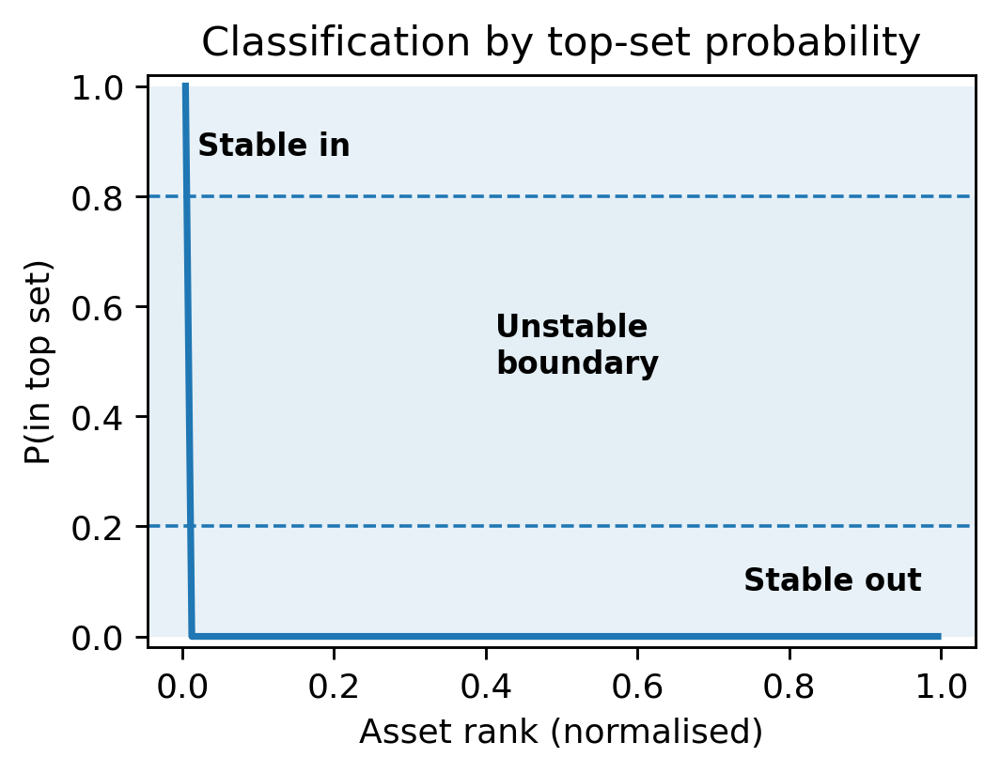

Figure 2 illustrates the central decision structure explored in the paper. Most assets exhibit stable prioritisation behaviour with posterior top-k membership probabilities close to either 0 or 1. Only a narrow intermediate boundary region exhibits unstable prioritisation behaviour under posterior uncertainty.

## Cross-city transfer concept

Figure 3 illustrates the fixed-specification transfer experiment. The model specification, priors, feature definitions, and scaling remain fixed while the framework is applied across different cities. Under distributional shift, ranking variability may increase locally near the prioritisation boundary.

---

# 3. Experimental Design

## 3.1 Phase 1 — Rotterdam baseline

The baseline implementation is performed using Rotterdam as the reference study area (~221,324 buildings).

Exposure is represented using hydrographic proximity indicators including distance to water and local water density aggregation. Hazard is represented using an ERA5-derived pluvial precipitation proxy.

A synthetic Bernoulli outcome variable is used in order to isolate the behaviour of the probabilistic inference-to-decision pipeline from empirical calibration challenges.

Posterior-derived decision metrics are computed from posterior draws rather than deterministic risk scores.

## 3.2 Phase 2 — Hazard perturbation

Robustness is evaluated through controlled perturbation of the hazard proxy.

The standardised hazard representation is perturbed with additive Gaussian noise while maintaining the same model structure and inference procedure.

The objective is not to simulate physically realistic perturbations, but to evaluate whether instability diffuses across the prioritisation system under degraded hazard representation.

## 3.3 Phase 3 — Cross-city transfer

The framework is transferred from Rotterdam to Hamburg and Donostia--San Sebastián under fixed specification:

- same priors
- same model structure
- same feature definitions
- same scaling reference
- same decision metrics

Rotterdam statistics are retained as the scaling reference for transferred cities.

The objective is not predictive optimisation for each city individually, but evaluation of whether the decision-stability structure persists under fixed specification and distributional shift.

---

# 4. Bayesian Model

The model defines a simple generative structure linking exposure, hazard proxy, and binary impact outcome.

Asset-level impact probability is modelled using a logistic regression structure:

$$
p_i =
\operatorname{logit}^{-1}
\left(
\alpha + \beta_E E_i + \beta_H H_i
\right)
$$

$$
Y_i \sim \operatorname{Bernoulli}(p_i)
$$

where:

- $E_i$ denotes the exposure proxy
- $H_i$ denotes the hazard proxy
- $Y_i \in \{0,1\}$ denotes the impact indicator

## Priors

Weakly informative priors are assigned to model parameters:

$$
\alpha, \beta_E, \beta_H \sim \mathcal{N}(0, 2.5)
$$

## Inference

Posterior inference is performed using PyMC with Hamiltonian Monte Carlo sampling through the NUTS sampler.

Inference is performed using:

- 4 chains
- 1000 tuning iterations
- 1000 posterior draws per chain
- `target_accept = 0.9`

Diagnostics include:

- $\hat{R}$ convergence diagnostics
- effective sample size (ESS)
- prior predictive checks
- posterior predictive checks

## Prior predictive validation

Prior predictive checks were used to verify that the prior specification does not imply implausibly high citywide event rates before observing the synthetic outcome data.

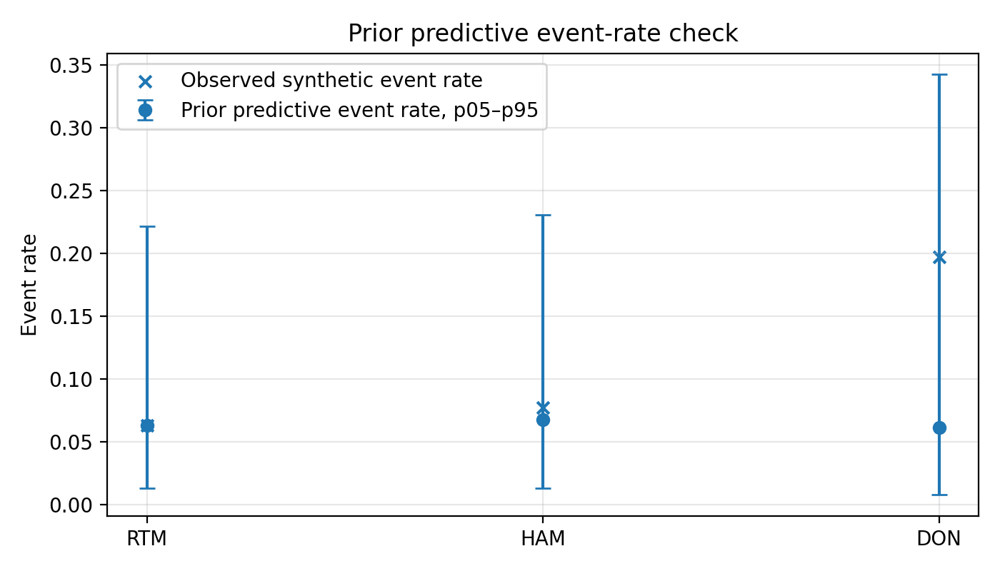

The prior predictive distribution remains compatible with low baseline event rates while still allowing uncertainty across cities. This supports the use of the prior specification as a weakly informative baseline rather than an implicit high-risk assumption.

All reported models achieved stable convergence behaviour under the current specification.

## Model scope

The logistic specification is intentionally minimal, serving as a baseline to isolate the behaviour of posterior-derived decision metrics rather than to optimise predictive performance.

The present results should therefore not be interpreted as hydraulic validation or operational flood prediction.

---

# 5. Posterior-Derived Decision Metrics

Rather than relying on point estimates, prioritisation decisions are derived directly from posterior draws.

For each posterior draw:

1. asset-level impact probabilities are computed
2. assets are ranked
3. the top-k subset is extracted

This produces a posterior distribution over prioritisation membership rather than a single deterministic ranking.

## Posterior mean risk

$$
p_{\text{mean}, i}
=
\mathbb{E}_{p(\theta \mid \text{data})}
\left[
P(Y_i = 1 \mid \theta)
\right]
$$

## Top-k membership probability

For a prioritisation threshold $k$, the probability that asset $i$ belongs to the top-k highest risk assets is:

$$
P(i \in \text{Top}_k \mid \text{posterior})
$$

This quantity forms the primary inferential object of the analysis.

## Borderline share

Borderline share is defined as:

$$
0.2 < P(i \in \text{Top}_k) < 0.8
$$

These assets form the prioritisation boundary where decision outcomes remain unstable under posterior uncertainty.

---

# 6. Results

## 6.1 Rotterdam baseline

Figure 4 shows the empirical cumulative distribution of posterior mean impact probabilities across Rotterdam.

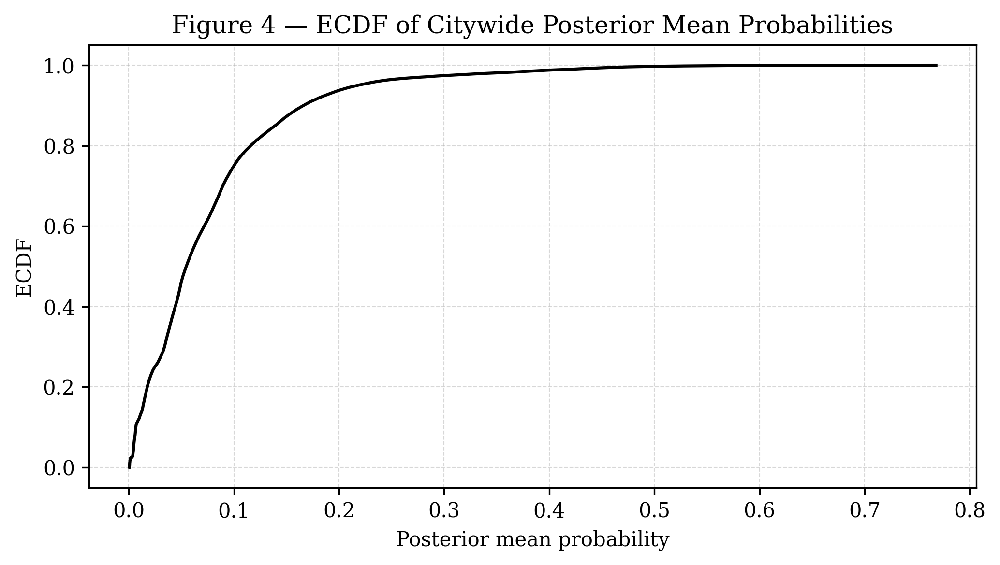

Posterior mean probabilities are strongly concentrated near low values, while only a small subset of assets occupy the upper tail of the distribution.

Decision stability is evaluated through posterior-derived top-k membership probabilities. Figure 5 shows that, across prioritisation thresholds, borderline share remains extremely small relative to the total asset population.

For the Top-1000 prioritisation threshold, most assets exhibit highly polarised membership probabilities close to either 0 or 1.

Figure 6 illustrates the deterministic ranking structure induced by posterior mean risk estimates.

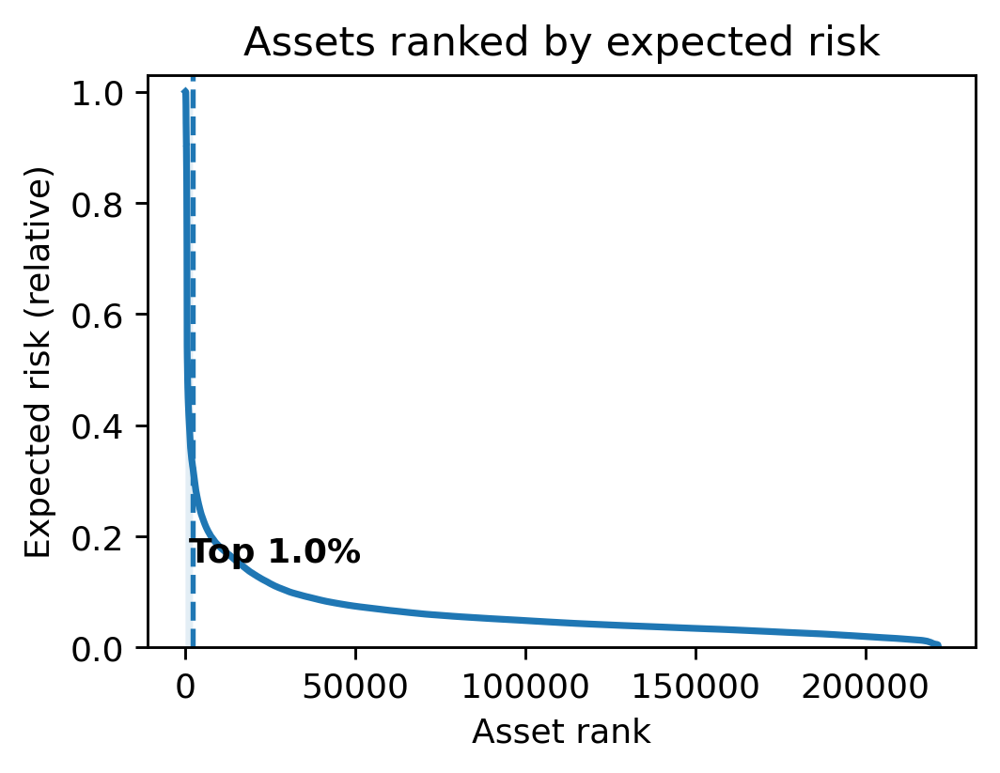

A small subset of assets occupies the upper tail of the prioritisation distribution, while the majority of assets exhibit substantially lower expected risk values. This concentration motivates the use of top-k prioritisation analysis under posterior uncertainty.

Figure 7 shows posterior top-k membership probability as a function of asset rank.

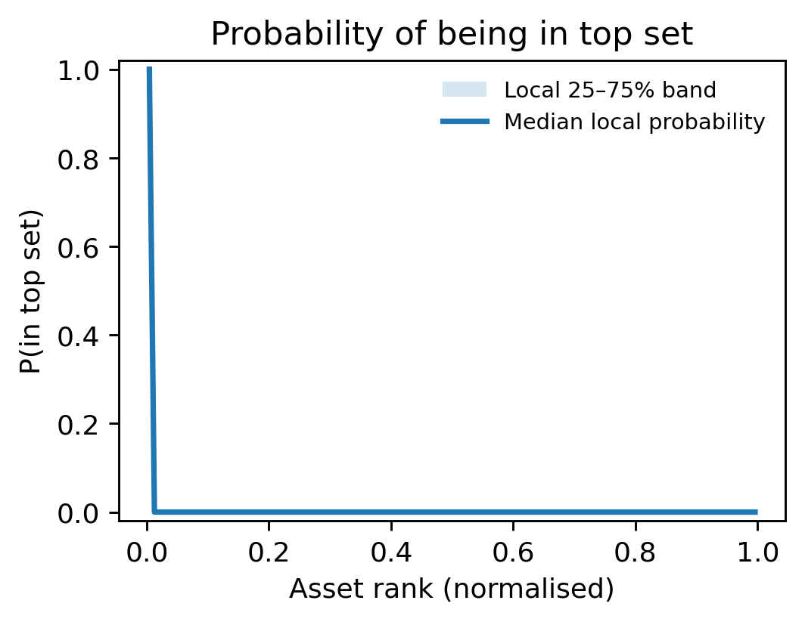

Most assets exhibit highly stable prioritisation behaviour with probabilities close to either 0 or 1. Only a very narrow boundary region exhibits intermediate membership probabilities, indicating localised instability rather than diffuse uncertainty across the prioritisation system.

## Posterior predictive checks

Figure 8 shows the posterior predictive check for the Rotterdam baseline model.

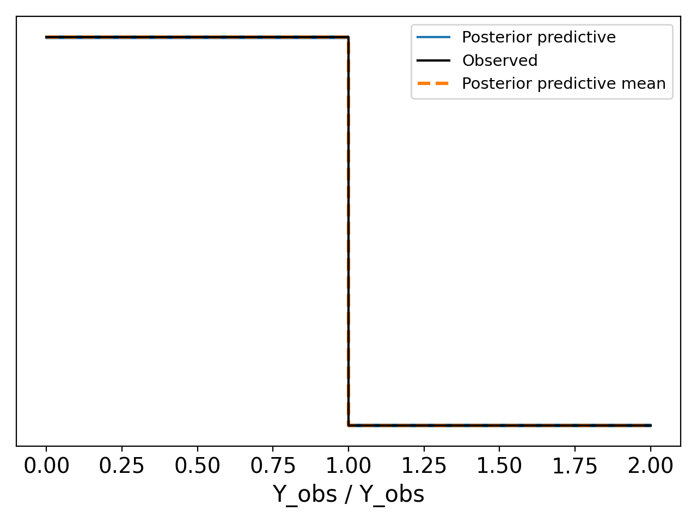

The posterior predictive distribution remains closely aligned with the observed synthetic outcome distribution, suggesting stable inference behaviour under the current baseline formulation.

---

## 6.2 Robustness to hazard perturbation

To evaluate whether the observed concentration of instability depends on deterministic hazard specification, controlled perturbations are introduced into the standardised hazard representation:

$$
H_i^{\text{perturbed}} = H_i + \epsilon_i,
\quad
\epsilon_i \sim \mathcal{N}(0, \sigma)
$$

The following perturbation levels are evaluated:

- $\sigma = 0.00$
- $\sigma = 0.05$
- $\sigma = 0.10$
- $\sigma = 0.20$
- $\sigma = 0.30$

| $\sigma$ | Borderline Share |
|---|---:|
| 0.00 | 0.0158 |
| 0.05 | 0.0130 |
| 0.10 | 0.0148 |
| 0.20 | 0.0172 |
| 0.30 | 0.0174 |

Figure 9 shows that increasing hazard perturbation does not produce diffuse instability across the system. Instead, instability remains concentrated near the prioritisation boundary across all tested perturbation levels.

---

## 6.3 Cross-city transfer

The same framework is applied to Hamburg and Donostia--San Sebastián under fixed specification.

### Rotterdam → Hamburg

The Hamburg transfer exhibits decision behaviour similar to the Rotterdam baseline. Top-k membership probabilities remain strongly polarised and borderline share remains negligible across evaluated prioritisation thresholds.

The concentration of instability near the prioritisation boundary therefore remains structurally preserved under transfer.

### Rotterdam → Donostia--San Sebastián

Donostia--San Sebastián exhibits moderate broadening of the unstable prioritisation boundary consistent with distributional shift, while overall instability remains spatially concentrated.

Figure 10 compares borderline share across cities and top-k thresholds under fixed-specification transfer.

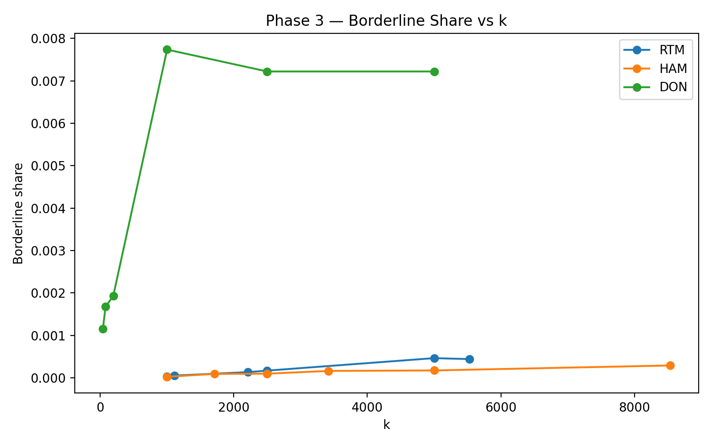

| City | Representative k | Assets | Borderline share |
|---|---:|---:|---:|
| RTM | 1000 | 221,324 | 0.0036% |
| HAM | 1000 | 341,530 | 0.0026% |
| DON | 1000 | 7,755 | 0.7737% |
| DON | 5000 | 7,755 | 0.7221% |

Table 1 summarises representative borderline-share values for each city under transfer.

The table shows the main transfer result directly. Rotterdam and Hamburg exhibit almost negligible borderline share, while Donostia--San Sebastián shows a wider unstable boundary. However, even under this stronger transfer stress, the borderline set remains below 1% of assets.

Figure 11 compares posterior top-k membership probability structure across Rotterdam, Hamburg, and Donostia--San Sebastián under fixed-specification transfer.

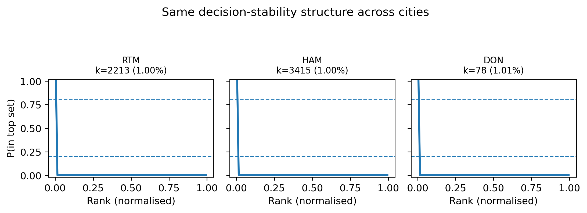

Across all three cities, posterior instability remains concentrated near a narrow prioritisation boundary. Rotterdam and Hamburg exhibit highly polarised membership structure, while Donostia--San Sebastián exhibits moderate local broadening of the unstable boundary region consistent with distributional shift.

Figures 12--14 show the spatial distribution of posterior top-k membership probability for the Rotterdam reference case and the two transferred cities.

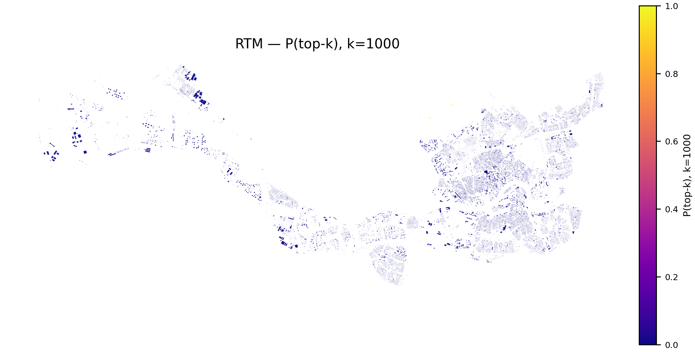

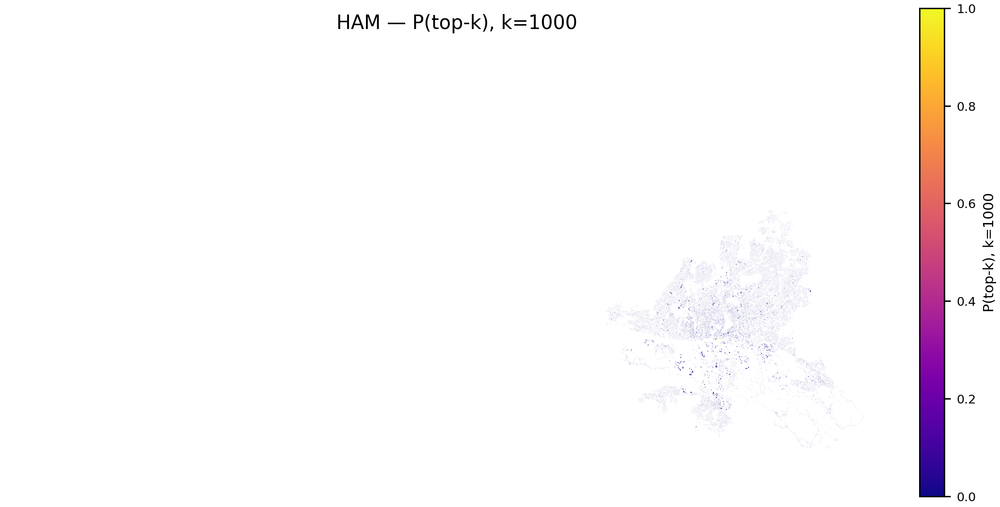

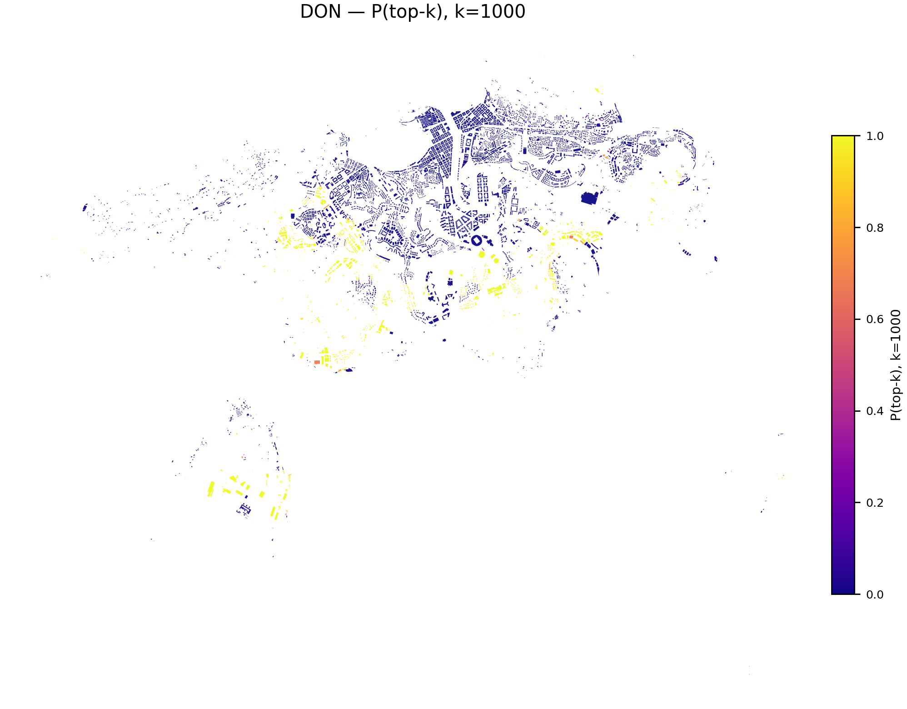

The Rotterdam and Hamburg maps show highly polarised posterior membership structure, with most assets assigned probabilities close to either 0 or 1. Donostia--San Sebastián exhibits increased local fragmentation near the prioritisation boundary under fixed-specification transfer. Despite this degradation, instability remains spatially concentrated rather than diffuse across the system.

The transfer experiments suggest that the concentration of decision instability near a narrow prioritisation boundary may represent a structural property of the inference-to-decision pipeline rather than a city-specific artefact.

---

# 7. Discussion

This study demonstrates how prioritisation decisions can be analysed as probabilistic objects rather than deterministic rankings.

By deriving decision metrics directly from posterior distributions, the framework evaluates not only which assets appear most at risk, but also how stable those prioritisation decisions remain under uncertainty propagation.

Across baseline, perturbation, and transfer experiments, posterior uncertainty remained concentrated near a relatively narrow prioritisation boundary while the majority of assets exhibited stable membership behaviour across posterior draws.

The perturbation experiments indicate that this structure is not highly sensitive to moderate degradation in hazard representation. Similarly, the transfer experiments suggest that the overall decision-stability structure may persist under moderate distributional shift when the model specification remains fixed.

The present results should not be interpreted as evidence of predictive generalisation across cities. The experiments instead evaluate whether posterior-derived decision behaviour remains structurally stable under fixed-specification transfer.

Likewise, the framework evaluates stability of prioritisation under uncertainty rather than correctness of prioritisation itself.

---

# 8. Limitations

Several limitations should be noted.

- The hazard representation is proxy-based and does not model hydraulic flood dynamics.
- The outcome variable is synthetic and not calibrated against observed damage data.
- Exposure is represented using simplified hydrographic proximity indicators.
- The current framework evaluates a single model family with limited prior sensitivity analysis.
- The framework does not currently include latent hazard processes or utility-theoretic decision modelling.

These simplifications are intentional in the present baseline study in order to isolate the statistical behaviour of posterior-derived prioritisation metrics.

No claims of operational deployment or empirical flood prediction are made.

---

# 9. Conclusion

This paper presented a Bayesian framework for analysing prioritisation decision stability under uncertainty propagation.

Rather than treating rankings as deterministic outputs, the framework derives posterior-based decision quantities that quantify uncertainty in prioritisation membership itself.

Across baseline, perturbation, and transfer experiments, instability remained concentrated near a narrow prioritisation boundary while most assets exhibited stable prioritisation behaviour under posterior uncertainty.

The contribution of the framework is methodological rather than hydraulic.

The results demonstrate how posterior inference can be extended from predictive estimation toward explicit analysis of prioritisation stability under uncertainty.

---

# References

Hall, J. W., & Harvey, H. (2009). Decision making under severe uncertainties for flood risk management: A case study of Info-Gap robustness analysis. *Journal of Flood Risk Management*.

Lv, H., Wu, Z., Guan, X., & Meng, Y. (2021). The construction of flood loss ratio function in cities lacking loss data based on dynamic proportional substitution and hierarchical Bayesian model. *Journal of Hydrology*.

McMillan, H., & Brasington, J. (2008). End-to-end flood risk assessment: A coupled model cascade with uncertainty estimation. *Water Resources Research*.

Mohor, G. S., et al. (2021). Residential flood loss estimated from Bayesian multilevel models. *Natural Hazards and Earth System Sciences*.

Sairam, N., Schröter, K., Rözer, V., Merz, B., & Kreibich, H. (2019). A Bayesian hierarchical model for flood damage estimation in data-scarce regions. *Water Resources Research*.

Wu, Y., et al. (2019). Assessing urban flood disaster risk using Bayesian network model and GIS applications. *International Journal of River Basin Management*.

Wu, Y., et al. (2020). Urban flood disaster risk evaluation based on ontology and Bayesian Network. *Journal of Hydrology*.

# Appendix A. Model input sample

A five-row sample of the Rotterdam model input table is provided to make the asset-level schema explicit. The full input tables are stored in:

- `outputs/phase3/RTM/phase3_features_scaled.parquet`
- `outputs/phase3/HAM/phase3_features_scaled.parquet`
- `outputs/phase3/DON/phase3_features_scaled.parquet`

| bldg_id | E_hat_v0 | H_pluvial_v1_mm | H_pluvial_v1_logrel | Y_damage |
|---|---:|---:|---:|---:|
| 305012 | -0.0333624 | 25.4222 | -0.00867723 | 0 |
| 313960 | 0.237889 | 25.4188 | -0.00880855 | 0 |
| 313263 | -0.130974 | 25.4231 | -0.00863978 | 0 |
| 310491 | -0.272604 | 25.4245 | -0.00858525 | 0 |
| 313127 | -0.342371 | 25.4235 | -0.00862493 | 0 |

The sample is included for transparency only and is not used directly for inference beyond illustrating the asset-level schema consumed by the model.